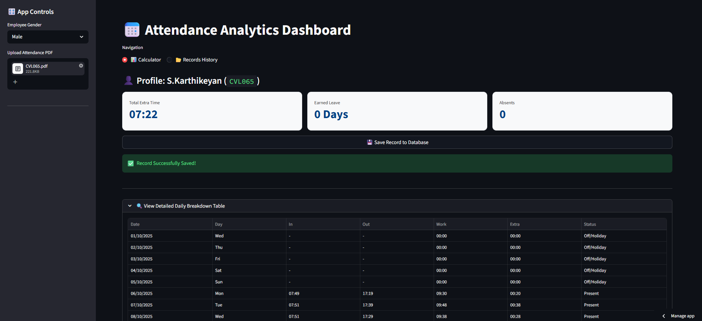

# 📅 Staff Attendance Tracker — Built with Streamlit, PyMuPDF & MongoDB

A professional-grade **staff attendance analytics dashboard** built with **Python** and **Streamlit**. Automatically parses biometric attendance PDFs, calculates extra hours, earned leave, and absences — and stores records in **MongoDB Atlas** for persistent tracking. Supports one-click **PDF report export** for management.

---

## 📸 Preview



---

## ✨ Features

- **PDF Parsing** — Automatically extracts attendance data (dates, punch-in/out times, day type) from biometric PDF reports using **PyMuPDF (fitz)**
- **Smart Extra Hours Calculation** — Computes extra time worked beyond standard hours with gender-aware thresholds (Male: 9h 10m / Female: 8h 25m on weekdays; 7h 10m on Saturdays)
- **Earned Leave Estimation** — Converts accumulated extra hours into compensatory leave days with a 20-minute tolerance buffer
- **Absence Detection** — Identifies and counts absent days from the PDF, even when mixed with punch data
- **MongoDB Persistence** — Saves processed records to **MongoDB Atlas** with SSL-safe connection handling
- **Professional PDF Export** — Generates a formatted summary report (CoE Monthly Biometric Summary) ready to hand to management
- **Record Management** — View all saved records, delete individual entries, or wipe all data from the dashboard
- **Clean Dashboard UI** — Wide-layout Streamlit app with styled metric cards, radio navigation, and collapsible daily breakdown tables

---

## 🛠️ Tech Stack

| Technology | Purpose |
|---|---|
| Python | Core backend language |
| Streamlit | Interactive web dashboard |
| PyMuPDF (fitz) | PDF text extraction and parsing |
| Pandas | Data processing and tabular display |
| MongoDB Atlas | Cloud database for storing records |
| PyMongo | MongoDB driver with SSL/TLS support |
| FPDF2 | PDF report generation and export |
| python-dotenv | Secure environment variable management |
| Certifi | SSL certificate handling for cloud DB |

---

## 📦 Installation & Setup

### Prerequisites
- Python 3.8+
- A [MongoDB Atlas](https://www.mongodb.com/atlas) account and cluster

### Steps

```bash
# Clone the repository
git clone https://github.com/Badhri-Prasath-D-R/Staff_attendence_Tracker.git
cd Staff_attendence_Tracker

# (Optional) Create and activate a virtual environment
python -m venv venv
source venv/bin/activate       # macOS/Linux
venv\Scripts\activate          # Windows

# Install dependencies
pip install -r requirements.txt
```

### Configure MongoDB

Create a `.streamlit/secrets.toml` file:

```toml
MONGO_URI = "your_mongodb_atlas_connection_string"
```

Or set it as an environment variable in a `.env` file:

```
MONGO_URI=your_mongodb_atlas_connection_string
```

### Run the App

```bash
streamlit run app.py
```

Open your browser at `http://localhost:8501`

---

## 🗺️ App Navigation

The dashboard has two views toggled via a navigation radio button:

### 📊 Calculator View
1. Select the **employee gender** from the sidebar (affects standard hours threshold)
2. **Upload the biometric attendance PDF** from the sidebar
3. View the automatically computed metrics:
   - **Total Extra Time** worked beyond standard hours
   - **Earned Leave Days** calculated from extra hours
   - **Total Absences** detected in the report
4. **Save the record** to MongoDB with one click
5. Expand the **detailed daily breakdown table** to inspect individual days

### 📂 Records History View
- Browse all saved employee records from MongoDB
- **Export a professional PDF report** (CoE Monthly Biometric Summary) for management
- **Delete individual records** or wipe all data at once

---

## ⚙️ Attendance Logic

| Parameter | Male | Female |
|---|---|---|
| Standard Weekday Hours | 9h 10m | 8h 25m |
| Standard Saturday Hours | 7h 10m | 7h 10m |
| Earned Leave Threshold | 1 full standard day | 1 full standard day |
| Leave Tolerance Buffer | +20 minutes | +20 minutes |

**Status Assignment Rules:**
- If punch-in/out times exist → **Present** (even if "AB" flag appears in PDF)
- If "AB" flag found with no punch times → **Absent**
- Otherwise → **Off/Holiday**

---

## 📁 Project Structure

```
Staff_attendence_Tracker/
├── app.py               # Main Streamlit app — full dashboard logic
├── main.py              # Alternate/utility entry point
├── run_app.py           # App runner helper
├── requirements.txt     # Python dependencies
├── .gitignore           # Ignores .env and secrets
├── .devcontainer/       # Dev container config for Codespaces
└── README.md
```

---

## 🗺️ Roadmap

- [ ] Migrate from MongoDB Atlas to a local SQLite database for enhanced data privacy and governance
- [ ] Package the app as a standalone Windows executable (.exe) using PyInstaller
- [ ] Add multi-employee batch PDF processing
- [ ] Add month-over-month attendance trend charts

---
